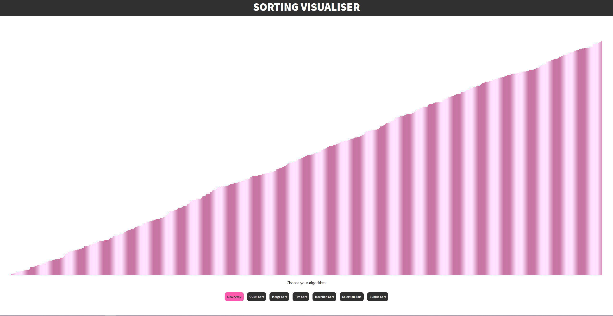

### Sorting Visualiser

Used ReactJS to visualise common sorting algorithms. [Check out the webpage!](https://eoinpinaqui.github.io/sorting/)

This app visualises:
- Quick sort
- Merge sort
- Tim sort 
- Insertion sort 
- Selection sort
- Bubble sort

This project was bootstrapped with [Create React App](https://github.com/facebook/create-react-app).